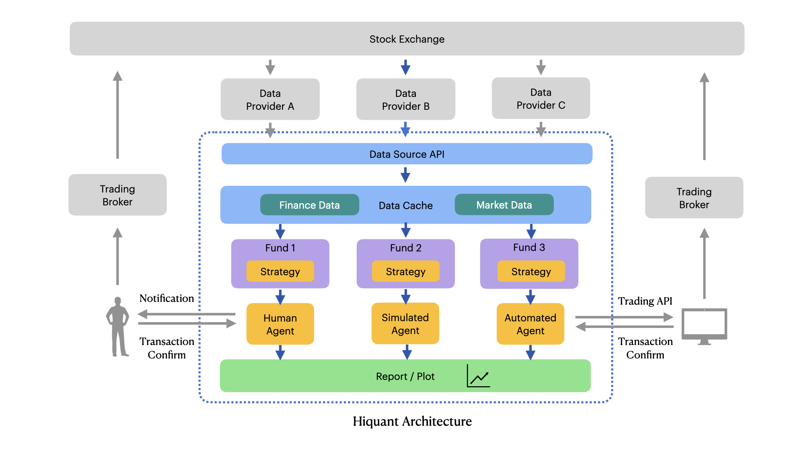

# How to develop based on Hiquant

## Architecture of Hiquant



## How to write a simple strategy

```python
import pandas as pd
import talib

from hiquant import *

class MyStrategy( BasicStrategy ):
    def __init__(self, fund, strategy_file):
        super().__init__(fund, strategy_file)

    def select_stock(self):
        return ['600036', '300122', '600519', '300357', '601888']

    def gen_trade_signal(self, symbol, init_data = False):
        market = self.fund.market
        if init_data:
            df = market.get_daily(symbol)
        else:
            df = market.get_daily(symbol, end = market.current_date, count = 26+9)

        dif, dea, macd_hist = talib.MACD(df.close, fastperiod=12, slowperiod=26, signalperiod=9)
        return pd.Series( CROSS(dif, dea), index=df.index )

    def get_signal_comment(self, symbol, signal):
        return 'MACD golden cross' if (signal > 0) else 'MACD dead cross'

    def before_market_open(self, param = None):
        pass

    def after_market_close(self, param = None):
        pass

def init(fund):
    strategy = MyStrategy(fund, __file__)
```

## How to write a complex strategy


## How to add more technical indicators


