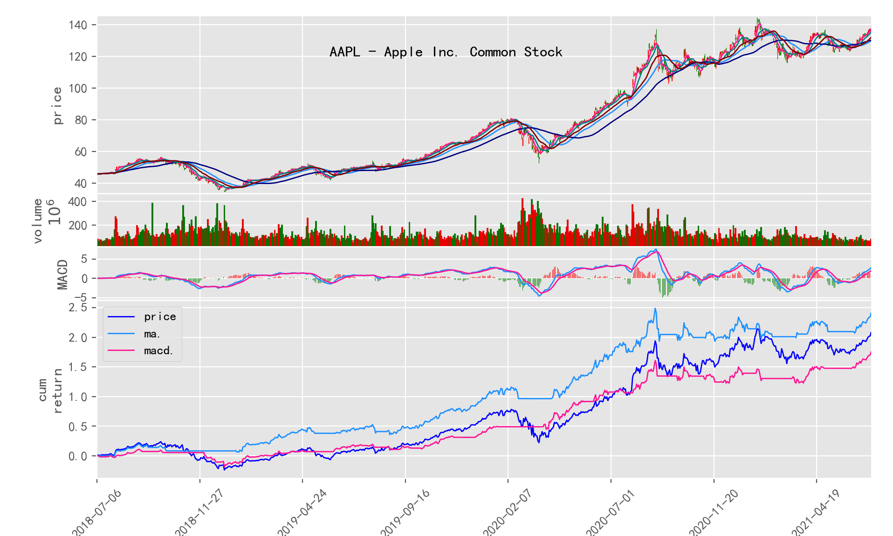
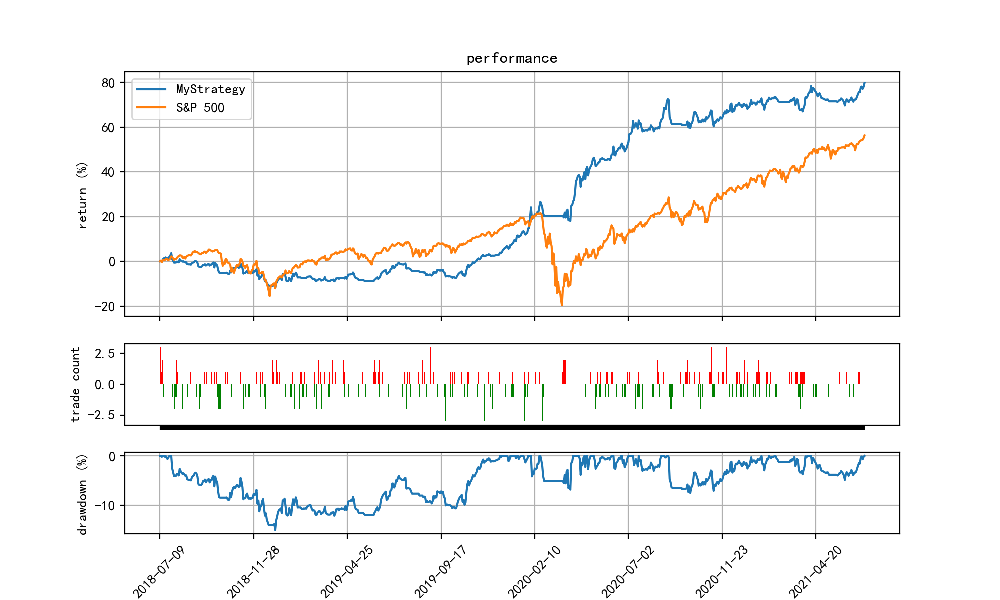

## Hiquant

[阅读此文档的中文版本](README_zh.md)

Hiquant is an out-of-box toolset for assiting stock investment and a library for study on quantitative trading.

It can run on any OS with Python 3, suggest Python v3.7+. 

This software is developed on Mac, and the examples in this document are written with Mac environment. They are similiar for Linux, but might be a little difference on Windows.

## Installation

```bash
pip install hiquant
```

Or, clone from GitHub:
```bash
git clone https://github.com/floatinghotpot/hiquant.git
cd hiquant
pip install -e .
```

## Quick Start

```bash
hiquant create myFund
cd myFund

hiquant list stock
hiquant list index

hiquant stock 600036 -ma -macd -kdj
hiquant stock 600519 -all
hiquant stock 600036 -wr -bias -mix

hiquant stockpool create stockpool/mystocks.csv 600036 600519 600276 300357 002258
hiquant finance view stockpool/mystocks.csv
hiquant pepb view stockpool/mystocks.csv

hiquant strategy create strategy/mystrategy.py
hiquant fund create myfund.conf
hiquant fund backtrade myfund.conf
```

## Usage

### Step 1, Create working folder for Hiquant

```bash
hiquant create MyFund
cd MyFund
```

### Step 2, Pull basic data

```bash
# download list of all stocks and indice
hiquant stock list update
hiquant index list update
```

Download financial reports (balance, income, cashflow), PE/PB data from Sina and Legu websites.

Notice:
- If download lots of data too fast, will be regarded as spider or network attack, and will cause IP banned by the websites.
- To avoid the consequence, the software will pause 2-3 seconds after download a piece of data. So it will take quite long time if download all financial reports.

Advice:
1. Download the financial reports once a quarter, as they are not updated frequently.
2. Only download daily data of those stocks concerned, no need to download every stock.
3. Arrange the download task to executed in nights.

```bash
# download financial reports (balance, income, cashflow, ipo info, dividend history)
# ~ 4300 stocks, 10 seconds each, totally, 400 MB data, 10 sec * 4300 = 12 hours
hiquant finance update all

# download PE/PB data of all stocks
# ~ 4300 stocks, 2 seconds each, totally, 650 MB data, 1 sec * 4300 = 2.4 hour
hiquant pepb update all
```

### Step 3, Financial Analysis, find "vluable" stocks
```bash
hiquant finance show all -ipo_years=3- -earn_ttm=1.0- -roe=0.20-1.0 -3yr_grow_rate=0.20- -sortby=roe -desc -out=stockpool/good_stock.csv
```

Comments on arguments:
-ipo_years=3-         filter condition: IPO > 3 years
-earn_ttm=1.0-        filter condition: Earn TTM > 0.1 Billion
-roe=0.20-1.0         filter condition: 20% < ROE < 100%
-3yr_grow_rate=0.20-  filter condition: Grow rate of net assets in recent 3 years > 20%

-sortby=roe                     Sort by ROE
-desc                           Sort descending, else ascending
-out=stockpool/good_stock.csv   Export result into file: stockpool/good_stock.csv

Logic of the filter condition:
1, Must on market for over 3 years.
2, Must earn money, annual profit no less than 0.1 Billion.
3, ROE > 20% (It is said that Buffett’s stock picking requirements are like this）
4, Grow rate of net assets in recent 3 years > 20%

Note: each column key can be used as filter or sort key

The selected stocks are exported into file: good_stock.csv

It's a "Stock pool" CSV file, containing symbol and name, in following file format:
```
symbol,name
002258,利尔化学
300357,我武生物
600036,招商银行
600276,恒瑞医药
600519,贵州茅台
... ...
```

### Step 4, Valuation analysis, find currently undervalued stocks

```bash
hiquant pepb view good_stock.csv -pb_pos=0-70 -sortby=pb_pos -out=stockpool/good_cheap_stock.csv
```

Comments on arguments:
-pb_pos=0-70                           PB historical percentile is between 0-70%
-sortby=pb_pos                         按Sort by PB historical percentile
-out=stockpool/good_cheap_stock.csv    Export result into file: stockpool/good_cheap_stock.csv

```bash
cp stockpool/good_cheap_stock.csv stockpool/mystocks.csv
```

### Step 5, Daily OHCL data and technical indicators

- Daily OHCL data

We need to use stock historical market data to simulate trading and calculate stock growth, so we need to download the K-line historical market data of individual stocks and post-restoration factors.

Since the stock historical market data is updated daily, usually only download the daily data of some stocks that you care about.

In order to avoid being banned by the financial website as a web crawler, this download process is also delayed for 3 seconds, and each stock download is about 6 seconds.

There is no need to manually download the daily stock data, the program will automatically download and cache it in the cache/market directory when it is used.

- Technical indicators

Some moving average algorithms and trading indicators are pre-defined in the program, including:
1. Moving average:
   SMA (Simple Moving Average)
   EMA (Exponential Moving Average)
   SMMA (Smoothed Moving Average)
   WMA (Weighted moving average)
   HMA (Hull Moving Average)

2. Trend indicators:
   MACD (Moving Average Convergence and Divergence)
   DMA (Parallel Line Difference Index)
   TRIX (Triple Exponential Smoothing Moving Average Index)
   VHF (Cross filter line index)

3. Overbought and oversold indicators:
   KDJ (Stochastic index)
   CCI (Choice Index)
   RSI (Relative Strength Index)
   WR (William Index)
   BOLL (Bollinger Band Index)
   BIAS (Disparity Rate Index)
   MFI (Money Flow Index)
   SAR (Parabolic indicator, or stop loss point turning indicator)

```bash
hiquant indicator bench stockpool/mystocks.csv -out=stockpool/mystocks_ind.csv
```
By executing this command, you can filter the best-performing indicators for each stock, sort them according to their returns, and output them to stockpool/mystocks_ind.csv

In addition, you can also view the performance of a certain stock's technical indicators more intuitively through the visualization of the drawing alone.

For example: plot a single or multiple indicators, and the performance of these indicators signal trading results:
```bash
hiquant stock 600036 -ma -macd -kdj
```


Another example: mixing multiple indicator signals, trading performance, and displaying trading actions and positions:
```bash
hiquant stock 600036 -cci -macd -kdj -mix
```


### Step 5, Create or edit stock pool file

Use this command to create a stock pool file:
```bash
hiquant stockpool create stockpool/mystocks.csv 600036 600519 300122 300357 601888
```

The stock pool file is a simple csv file containing stock symbols and names, in the following format:
```
symbol,name
300122,智飞生物
300357,我武生物
600036,招商银行
600519,贵州茅台
601888,中国中免
```

### Step 6, Create a trading strategy script

```bash
hiquant strategy create strategy/mystrategy.py
```

The trading strategy is a snippet of a python program, which needs to contain the following logic:
1. How to choose stocks
2. Number of shares held and positions
3. When to trigger trading signals
4. When to stop loss and profit

The following is a simple fixed stock pool, based on the MACD indicator trading strategy:
```python
import pandas as pd
import talib

from hiquant import *

class MyStrategy( BasicStrategy ):
    def __init__(self, fund, strategy_file):
        super().__init__(fund, strategy_file)
        self.max_stocks = 10
        self.max_weight = 1.2
        self.stop_loss = 1 + (-0.10)
        self.stop_earn = 1 + (+0.20)

    def select_stock(self):
        return ['600036', '300122', '600519', '300357', '601888']

    def gen_trade_signal(self, symbol, init_data = False):
        market = self.fund.market
        if init_data:
            df = market.get_daily(symbol)
        else:
            df = market.get_daily(symbol, end = market.current_date, count = 26+9)

        dif, dea, macd_hist = talib.MACD(df.close, fastperiod=12, slowperiod=26, signalperiod=9)
        return pd.Series( CROSS(dif, dea), index=df.index )

    def get_signal_comment(self, symbol, signal):
        return 'MACD golden cross' if (signal > 0) else 'MACD dead cross'

def init(fund):
    strategy = MyStrategy(fund, __file__)

    trader = fund.trader
    trader.run_daily(before_market_open, strategy, time='before_open')
    trader.run_on_bar_update(trade, strategy)
    trader.run_daily(trade, strategy, time='14:30')
    trader.run_daily(after_market_close, strategy, time='after_close')

def before_market_open(strategy):
    pass

def trade(strategy):
    strategy.trade()

def after_market_close(strategy):
    pass
```

### Step 7, Create a configration file for portoflios

```bash
hiquant fund create etc/myfund.conf
```

This is a configuration file that describes some parameters required for simulation backtesting and actual operation.

```
[main]
tick_period = 5 min
compare_index = sh000300

[fund_list]
1 = fund_1

[fund_1]
name = My Fun No.1
start_cash = 1000000.00
agent = agent_1
strategy = strategy/mystrategy.py

[agent_1]
agent_type = human
account = account_1
portfolio_load = data/{account}_portfolio_load.csv
portfolio_save = data/{account}_portfolio_save.csv
order = data/{account}_order.csv
push_to = email_1

[email_1]
push_type = email
mailto = your_name@gmail.com
sender = no-reply@gmail.com
server = 192.168.0.200
user = 
passwd =
```

### Step 8, Simulated backtrade

Historical market data can be used to test the investment portfolio back and forth (the default is to back-test for 3 years):
```bash
hiquant fund backtrade etc/myfund.conf
```

You can also specify any time period (year, month, day format: YYYYMMDD) for backtesting:
```bash
hiquant fund backtrade etc/myfund 20160101 20210101
```

The results of the back test are shown with plot:


If you describe multiple portfolio configuration information in fund_list, you can test multiple portfolio strategies at the same time and compare the results together:


### Step 9, Real-market simulation, monitor market changes and remind to buy/sell

In order to receive email reminders, please modify the email parameter configuration in myfund.conf (recipient, sender, server, etc.)
```
[email_1]
push_type = email
mailto = your_name@gmail.com
sender = no-reply@gmail.com
server = 192.168.0.200
user = 
passwd =
```

Then, run following command:
```bash
hiquant fund run etc/myfund.conf
```

If the stock market has not yet opened, it will wait; if it is at the opening time, it will obtain the latest stock price from the financial website every few minutes and make judgments based on the specified strategy.

If the trading conditions are triggered, the transaction will be simulated and an email will be sent to remind you to buy or sell stocks.

### Step 10, Strategy and parameter tuning

Modify the backtest configuration and run multiple portfolios at the same time. Each portfolio can be configured with different strategy codes or strategy parameters.

For example, in the configuration below, strategy 1 does not use stop loss/take profit, and strategy 2 uses stop loss/take profit. The final return performance is different.

```
[fund_list]
1 = fund_1
2 = fund_2

[fund_1]
name = Fund No. 1 (no stop loss)
start_cash = 1000000.00

strategy = strategy/mystrategy.py
stock_pool = stockpool/mystocks.csv
max_stocks = 10
max_weight = 1.2
## stop_loss = -0.10
## stop_earn = 0.20

[fund_2]
name = Fund No. 2 (with stop loss)
start_cash = 1000000.00

strategy = strategy/mystrategy.py
stock_pool = stockpool/mystocks.csv
max_stocks = 10
max_weight = 1.2
stop_loss = -0.10
stop_earn = 0.20
```

```bash
hiquant fund backtrade etc/2-two-funds.conf
```

The backtest result will be:


## Advanced: Develop your own trading strategy

Please refer to the document ["How to develop based on hiquant"] (DEV.md)

