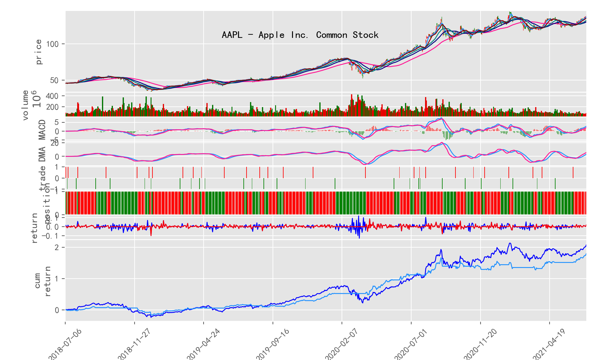
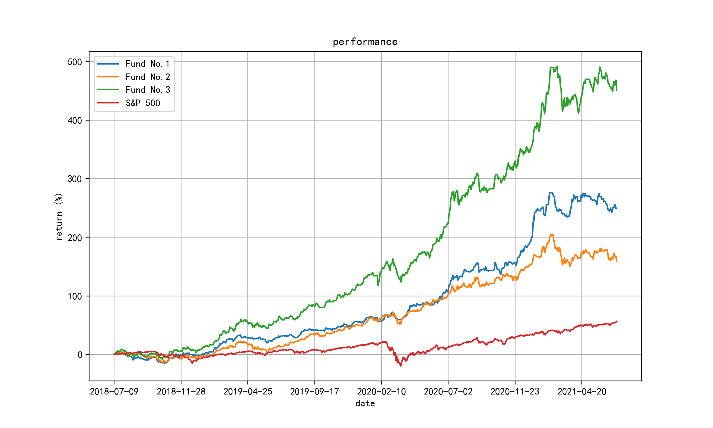
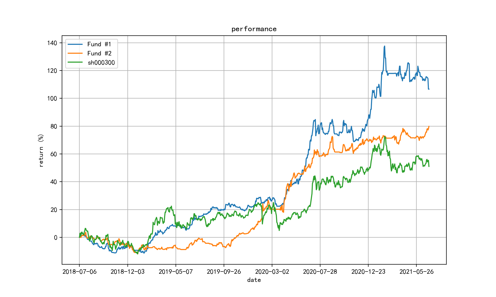

## HiQuant 说明文档

Hiquant 是一个用 Python 开发的 辅助股票投资的技术框架，以及一个开箱即用的命令行工具。

可以运行于任何支持 Python 的操作系统。建议 Python 3.7 以上。

本项目开发于 Mac 环境，因此本文的一些示范说明用于 Mac 环境，Linux 也差不多，Windows 可能有少量差异。

## 如何安装

```bash
pip install hiquant
```

或者 从 GitHub 复制：
```bash
git clone https://github.com/floatinghotpot/hiquant.git
cd hiquant
pip install -e .
```

## 快速体验

```bash
hiquant create myFund
cd myFund

hiquant stock list update
hiquant index list update

hiquant stock 600036 -ma -macd -kdj
hiquant stock 600519 -all
hiquant stock 600036 -wr -bias -mix

hiquant stockpool create stockpool/mystocks.csv 600036 600519 600276 300357 002258
hiquant finance view stockpool/mystocks.csv
hiquant pepb view stockpool/mystocks.csv

hiquant strategy create strategy/mystrategy.py
hiquant fund create myfund.conf
hiquant fund backtrade myfund.conf
```

## 如何使用

### 第 1 步，创建 hiquant 工作目录

```bash
hiquant create MyFund
cd MyFund
```

### 第 2 步，获取 基本数据

```bash
# 下载所有 A 股上市公司的列表（约4300多家）以及指数
hiquant stock list update
hiquant index list update
```

需要从财经网站（新浪、乐股等），下载股票相关的基本面数据，包括：上市公司财报（资产负债表、现金流量表、损益表）、市盈率市净率等。

注意：
如果过于快速和频繁下载大量数据，有可能被财经网站视为网络攻击或者网络爬虫而被暂时封禁IP。
为了避免这个结果，程序每下载一条数据，会等待 3-5 秒钟。因此，如果下载大量上市公司的财报或者行情，可能时间会比较长。

建议：
1、财报 不需要经常下载，一个季度下载一次 即可。
2、个股行情 不需要所有个股都下载，只下载自己关心的个股行情数据 即可。
3、下载数据的任务，建议安排到 晚上进行。

```bash
# 下载所有 A 股上市公司的 3 张财报、IPO信息、分红/送股信息
#（4300个股票，约 400 MB数据，需要 10秒 * 4300 = 12 小时）
hiquant finance update all

# 下载所有 A 股上市公司的 市盈率市净率数据
#（4300个股票，约 650 MB数据，需要 1.5 小时）
hiquant pepb update all
```

### 第 3 步, 基本面分析，筛选出 价值股票
```bash
hiquant finance show all -ipo_years=3- -earn_ttm=1.0- -roe=0.20-1.0 -3yr_grow_rate=0.20- -sortby=roe -desc -out=stockpool/good_stock.csv
```

参数解释如下：
-ipo_years=3-         过滤条件为 上市大于 3年
-earn_ttm=1.0-        过滤条件为 年利润 > 1亿
-roe=0.20-1.0         过滤条件为 20% < ROE < 100%
-3yr_grow_rate=0.20-  过滤条件为 最近3年 净资产增长率 > 20%

-sortby=roe                     按照 ROE 排序
-desc                           排序列 从大到小 逆排序
-out=stockpool/good_stock.csv   输出结果写入 stockpool/good_stock.csv

筛选条件的逻辑是：
1、上市超过 3年以上；（部分新公司为了完成上市的对赌协议，可能会把财务报表做得漂亮）
2、公司必须赚钱，年净利润不少于 1亿；
3、净资产收益率（ROE）高于 20%；（据说巴菲特选股的条件是这样的）
4、最近 3年净资产成长率高于 20%；

注：每一列都可以用作过滤或者排序的关键字。

筛选出的股票，写入文件 good_stock.csv。
这是个仅包含股票代码、股票名称的 “股票池”文件，格式如下：
```
symbol,name
002258,利尔化学
300357,我武生物
600036,招商银行
600276,恒瑞医药
600519,贵州茅台
... ...
```

### 第 4步，估值分析，筛选出目前 价值低估 的 便宜股票

```bash
hiquant pepb view good_stock.csv -pb_pos=0-70 -sortby=pb_pos -out=stockpool/good_cheap_stock.csv
```

参数解释如下：
-pb_pos=0-70                           PB 历史百分位 在 0-70% 之间 
-sortby=pb_pos                         按照 PB 历史百分位排序
-out=stockpool/good_cheap_stock.csv    输出结果写入 stockpool/good_cheap_stock.csv

```bash
cp stockpool/good_cheap_stock.csv stockpool/mystocks.csv
```

### 第 5 步, 日线数据 以及 技术指标

日线数据

我们需要用股票的历史行情，来模拟交易和计算股票的成长性，所以需要下载个股的 K线历史行情数据 和 后复权因子。

由于股票历史行情数据每日更新，通常只下载自己关心的部分股票的日线数据。

为了避免被 财经网站 判定为网络爬虫而封禁 IP，这个下载过程也稍微做了 3秒钟 的延迟处理，每下载1只股票约 6秒钟。

不需要手动下载股票的日线数据，程序会在用到的时候自动下载 并缓存到 cache/market 目录下。

技术指标

程序内 预先定义了一些均线算法 和 交易指标，包括：
1、均线：
  SMA（简单移动均线）
  EMA（指数移动均线）
  SMMA（平滑均线）
  WMA（加权均线）
  HMA（赫尔均线）

2、趋势指标：
  MACD（平滑异同移动平均线）
  DMA（平行线差指标）
  TRIX（三重指数平滑移动平均指标）
  VHF（十字过滤线指标）

3、超买超卖指标：
  KDJ（随机指标）
  CCI（顺势指标）
  RSI（相对强弱指标）
  WR（威廉指标）
  BOLL（布林带指标）
  BIAS（乖离率指标）
  MFI（资金流量指标）
  SAR（抛物线指标，或停损点转向指标）

```bash
hiquant indicator bench stockpool/mystocks.csv -out=stockpool/mystocks_ind.csv
```
执行这个命令，可以为每只股票筛选出表现最好的指标，并且按照其收益率排序，输出到 stockpool/mystocks_ind.csv

此外，也可以单独通过绘图可视化的方式，更加直观地查看 某只股票 的技术指标 表现情况。

例如：绘制某个单独或者多个指标，并绘制这些指标信号交易结果的表现
```bash
hiquant stock 600036 -ma -macd -kdj
```


例如：混合多个指标信号 交易的表现，并显示交易动作和持仓情况
```bash
hiquant stock 600036 -cci -macd -kdj -mix
```


### 第 5 步，创建和编辑 股票池

使用这个命令可以创建一个股票池文件
```bash
hiquant stockpool create stockpool/mystocks.csv 600036 600519 300122 300357 601888
```

股票池文件是一个包含股票代码以及名称的简单 csv 文件，格式如下：
```
symbol,name
300122,智飞生物
300357,我武生物
600036,招商银行
600519,贵州茅台
601888,中国中免
```

### 第 6 步，创建一个交易策略文件

```bash
hiquant strategy create strategy/mystrategy.py
```

交易策略是一个 python 程序片段，在其中需包含如下逻辑：
1、如何选股
2、持股数量、仓位
3、何时触发 交易信号
4、何时止损、止盈

以下是一个简单的固定股票池，根据 MACD 指标交易的 策略：
```python
import pandas as pd
import talib

from hiquant import *

class MyStrategy( BasicStrategy ):
    def __init__(self, fund, strategy_file):
        super().__init__(fund, strategy_file)
        self.max_stocks = 10
        self.max_weight = 1.2
        self.stop_loss = 1 + (-0.10)
        self.stop_earn = 1 + (+0.20)

    def select_stock(self):
        return ['600036', '300122', '600519', '300357', '601888']

    def gen_trade_signal(self, symbol, init_data = False):
        market = self.fund.market
        if init_data:
            df = market.get_daily(symbol)
        else:
            df = market.get_daily(symbol, end = market.current_date, count = 26+9)

        dif, dea, macd_hist = talib.MACD(df.close, fastperiod=12, slowperiod=26, signalperiod=9)
        return pd.Series( CROSS(dif, dea), index=df.index )

    def get_signal_comment(self, symbol, signal):
        return 'MACD golden cross' if (signal > 0) else 'MACD dead cross'

def init(fund):
    strategy = MyStrategy(fund, __file__)

    trader = fund.trader
    trader.run_daily(before_market_open, strategy, time='before_open')
    trader.run_on_bar_update(trade, strategy)
    trader.run_daily(trade, strategy, time='14:30')
    trader.run_daily(after_market_close, strategy, time='after_close')

def before_market_open(strategy):
    pass

def trade(strategy):
    strategy.trade()

def after_market_close(strategy):
    pass
```

### 第 7 步，创建一个投资组合配置文件

```bash
hiquant fund create etc/myfund.conf
```

这是一个配置文件，描述了 模拟回测 和 实盘运行 需要的一些参数。

```
[main]
tick_period = 5 min
compare_index = sh000300

[fund_list]
1 = fund_1

[fund_1]
name = My Fun No.1
start_cash = 1000000.00
agent = agent_1
strategy = strategy/mystrategy.py

[agent_1]
agent_type = human
account = account_1
portfolio_load = data/{account}_portfolio_load.csv
portfolio_save = data/{account}_portfolio_save.csv
order = data/{account}_order.csv
push_to = email_1

[email_1]
push_type = email
mailto = your_name@gmail.com
sender = no-reply@gmail.com
server = 192.168.0.200
user = 
passwd =
```

### 第 8 步，模拟回测

可用历史行情数据，来回测投资组合（默认是倒推 3年回测）：
```bash
hiquant fund backtrade etc/myfund.conf
```

也可以指定任意时间段 （年月日格式：YYYYMMDD）进行回测：
```bash
hiquant fund backtrade etc/myfund.conf 20160101 20210101
```

回测结果 图形显示为：


如果在 fund_list 中描述多个投资组合配置信息，就可以同时测试多个策略，并将结果放在一起比较：


### 第 9 步，实盘模拟，盯盘提醒 买入/卖出

为了收到邮件提醒，请修改 myfund.conf 中的邮件参数配置（收件人、发送方 以及服务器等）
```
[email_1]
push_type = email
mailto = your_name@gmail.com
sender = no-reply@gmail.com
server = 192.168.0.200
user = 
passwd =
```

然后就可以运行：
```bash
hiquant fund run etc/myfund.conf
```

如果是股市开市时间，每 5分钟，它会从财经网站获取最新股价，并根据指定的策略进行判断。

如果触发交易条件，则模拟交易，并发邮件提醒。

### 第 10 步，策略 和 参数调优

修改回测配置，同时运行 多个投资组合，分别 配置不同的 策略代码 或者 策略参数。

例如下方的配置，策略1 是不做止损/止盈，策略2 是做了止损/止盈，最终的收益表现 是不一样的。

```
[fund_list]
1 = fund_1
2 = fund_2

[fund_1]
name = 财富1号基金（无止损）
start_cash = 1000000.00

strategy = strategy/mystrategy.py
stock_pool = stockpool/mystocks.csv
max_stocks = 10
max_weight = 1.2
## stop_loss = -0.10
## stop_earn = 0.20

[fund_2]
name = 财富2号基金（止损/止盈）
start_cash = 1000000.00

strategy = strategy/mystrategy.py
stock_pool = stockpool/mystocks.csv
max_stocks = 10
max_weight = 1.2
stop_loss = -0.10
stop_earn = 0.20
```

```bash
hiquant fund backtrade etc/2-two-funds.conf
```

测试结果显示为：


## 进阶：开发自己的 交易策略

如何使用请参见 文档[《如何基于 hiquant 开发》](DEV.md)
